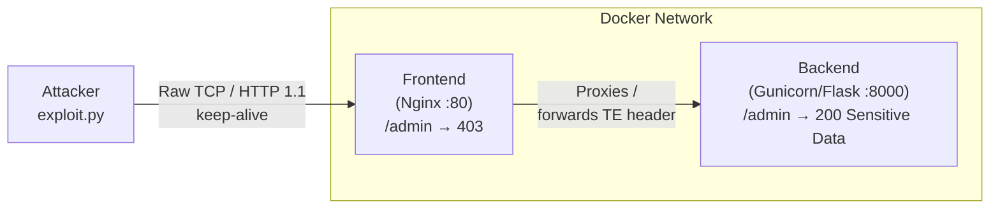

# HRS-Desynchronization

> **Cybersecurity Course Project** – Proof-of-Concept for a **CL.TE HTTP Request Smuggling** attack.  
> Exploits parsing discrepancies between Nginx and Gunicorn to bypass a simulated security boundary and access a restricted `/admin` endpoint.

---

## Architecture



**Text-based ASCII diagram**

```
  ┌─────────────┐        port 80         ┌──────────────────┐       internal      ┌─────────────────────┐
  │  Attacker   │ ──── keep-alive TCP ──▶ │  Nginx (frontend)│ ── HTTP/1.1 proxy ─▶│ Gunicorn/Flask (be) │
  │  exploit.py │                         │  /admin → 403    │                     │  /admin → 200       │
  └─────────────┘                         └──────────────────┘                     └─────────────────────┘
```

### How the attack works (CL.TE)

| Actor | Header trusted | Body boundary |
|-------|---------------|---------------|
| **Nginx** (frontend) | `Content-Length` | Reads **all** N bytes and forwards them |
| **Gunicorn** (backend) | `Transfer-Encoding: chunked` | Stops at `0\r\n\r\n` terminal chunk |

The bytes **after** the terminal chunk (`GET /admin HTTP/1.1\r\nX-Ignore: x`) are left in the TCP socket buffer.  
When the next (victim) request arrives on the **same keep-alive connection**, Gunicorn prepends those leftover bytes, rewriting the victim's request line to `/admin`.

---

## Repository Layout

```
HRS-Desynchronization/
├── docker-compose.yml        # Defines frontend + backend services
├── nginx/
│   ├── Dockerfile            # Alpine Nginx image
│   └── nginx.conf            # Reverse proxy config (desync-enabling)
├── backend/
│   ├── Dockerfile            # Alpine Python 3.12 image
│   ├── requirements.txt      # Flask + Gunicorn
│   ├── app.py                # Flask routes: / and /admin
│   └── wsgi.py               # Gunicorn config (keep-alive, sync worker)
├── exploit.py                # Raw-socket CL.TE smuggling script
└── README.md
```

---

## Phase 1 – Setup

### Prerequisites

- Docker ≥ 24 and Docker Compose v2
- Python ≥ 3.10 (for `exploit.py`)

### Start the stack

```bash
# Build images and start containers in the background
docker compose up --build -d

# Verify both containers are running
docker compose ps
```

Expected output:

```
NAME                        STATUS          PORTS
hrs-...-frontend-1          Up              0.0.0.0:80->80/tcp
hrs-...-backend-1           Up              8000/tcp
```

### Confirm the security boundary works

```bash
# Should return 403 Forbidden (Nginx blocks /admin directly)
curl -i http://localhost/admin

# Should return 200 with the public homepage
curl -i http://localhost/
```

---

## Phase 2 – Exploit Execution

```bash
# Run the exploit against the local stack
python exploit.py --host localhost --port 80
```

### What happens step-by-step

1. **Attack request** – A single `POST /` is sent with *both* `Content-Length` and `Transfer-Encoding: chunked`.  
   Nginx trusts `Content-Length` and forwards the whole body.  
   Gunicorn trusts `Transfer-Encoding` and stops at the `0\r\n\r\n` terminator, leaving  
   `GET /admin HTTP/1.1\r\nX-Ignore: x` in the socket buffer.

2. **Victim request** – A plain `GET /` is sent on the **same TCP connection**.  
   Gunicorn prepends the buffered bytes, so it processes `GET /admin …` instead.

3. **Result** – The response to the victim request contains `Sensitive Admin Data`, proving  
   the `/admin` security boundary was bypassed.

### Sample successful output

```
[*] Target : localhost:80
[*] Connecting …
[*] Sending attack request (CL.TE smuggling) …
...
[*] Sending victim request …
...
[*] Response to victim request (should contain admin data if smuggling succeeded):
HTTP/1.1 200 OK
...
Sensitive Admin Data

[+] SUCCESS – smuggled /admin request reached the backend!
```

---

## Phase 3 – Mitigation

### 3.1 Reject dual-length headers in Nginx

Replace the vulnerable `location /` block in `nginx/nginx.conf` with the hardened version below.  
The key directive is `proxy_request_buffering on` combined with `ignore_invalid_headers off` and an explicit map that rejects requests that carry **both** `Content-Length` and `Transfer-Encoding`.

```nginx
# nginx.conf (hardened)

http {
    # Reject requests that specify both Content-Length and Transfer-Encoding.
    map $http_transfer_encoding $reject_dual_header {
        default  0;
        ~.+      $http_content_length;   # non-empty TE header
    }

    server {
        listen 80;
        server_name _;

        # Block requests with conflicting length headers.
        if ($reject_dual_header) {
            return 400 "Ambiguous request rejected\n";
        }

        location /admin {
            return 403 "Forbidden\n";
        }

        location / {
            proxy_pass             http://backend:8000;
            proxy_http_version     1.1;
            proxy_set_header       Connection "";
            proxy_set_header       Host $host;
            proxy_set_header       X-Real-IP $remote_addr;
            # Do NOT forward Transfer-Encoding to the backend.
            proxy_set_header       Transfer-Encoding "";
            proxy_request_buffering on;
        }
    }
}
```

### 3.2 Upgrade to HTTP/2

HTTP/2 uses a binary, length-prefixed framing layer that eliminates header ambiguity entirely.  
Enabling HTTP/2 on the Nginx frontend makes CL.TE and TE.CL attacks impossible at the protocol level.

```nginx
server {
    listen 443 ssl http2;
    # ... TLS configuration ...
}
```

> **Note:** HTTP/2 is only supported over TLS in most browsers, but backend proxying  
> can still use HTTP/1.1 internally.

### 3.3 Additional hardening recommendations

| Measure | Effect |
|---------|--------|
| Normalise TE headers in WAF/load-balancer | Strip or reject `Transfer-Encoding` variants (e.g. `chunked, identity`) |
| Use a single authoritative parser | Deploy a unified proxy layer (e.g. Envoy) that buffers entire requests before forwarding |
| Enable `merge_slashes off` + strict URI validation | Reduces attack surface for path confusion |
| Gunicorn `--forwarded-allow-ips` | Prevents forged `X-Forwarded-*` header injection |

---

## Teardown

```bash
docker compose down
```

---

## Disclaimer

This project is created **solely for educational purposes** as part of a cybersecurity course.  
Do **not** use these techniques against systems you do not own or have explicit written permission to test.
